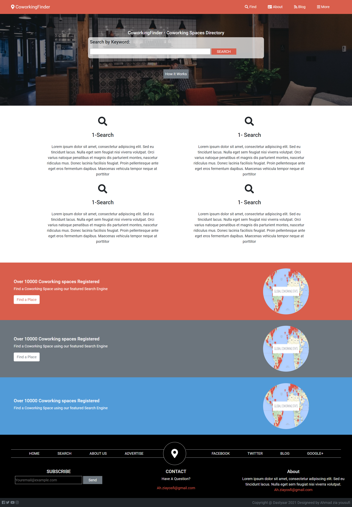

# Responsive Design Newsweek Project

> This project shows different ways that can help us make our website reponsive to all the screen sizes by using Bootstrap.

## Built With

- HTML
- CSS

## Framework

-Bootstrap 5

## Live Demo

[Live Demo Link]()

## Getting Started

1. Clone the project 
  `$ git clone https://github.com/ahzia/Coworking-Space-Directory`
2. Then open index.html in your browser

To get a local copy up and running follow these simple example steps.

### Prerequisites

Just ensure you have one or more web browsers

## Authors

:bust_in_silhouette: **Author1**

- GitHub: [@ahzia](https://github.com/ahzia)
- Twitter: [@ZiaYousofi](https://twitter.com/ZiaYousofi)
- LinkedIn: [Ahmad zia Yousufi](https://https://www.linkedin.com/in/ah-ziayosfi)

## :handshake: Contributing

Contributions, issues, and feature requests are welcome!
Feel free to contribute 
Feel free to check the [issues page]().

## Show your support

Give a ⭐️ if you like this project!

