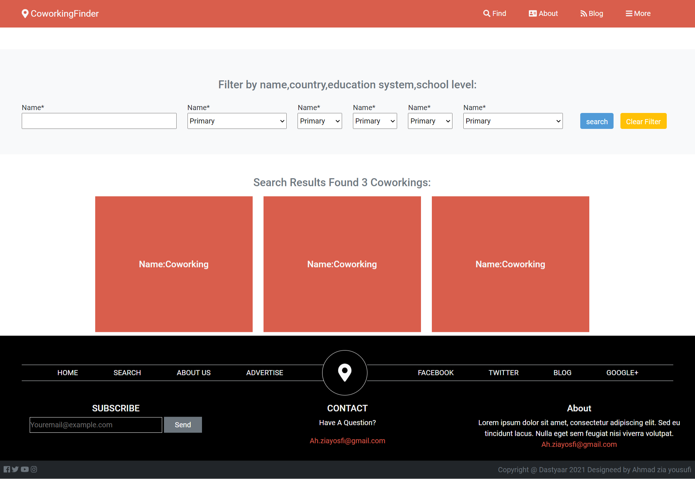
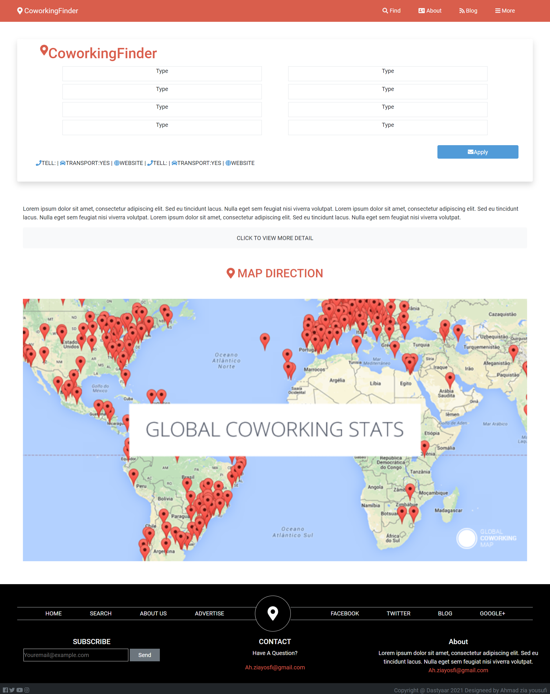

# Capstone Project:Coworkingspace Directory

> This is a Responisve website based on [design](https://www.behance.net/gallery/25563385/PatashuleKE) by Matthew Njuguna & Sam Achola (Behance).

The project is HTML & CSS Capstone Project assigned by microverse to me check the original project specifications from [Microverse Capstone Project - Directory of Schools](https://www.notion.so/HTML-CSS-capstone-project-Directory-of-Schools-eea352bfaf3e4a83b2917df1f9a4e140)

### Main page

### Search results page

### Details page

Project requirements included using semantic HTML tags, CSS selectors, HTML elements box model (margin, padding, width, height), Bootstrap, creating UIs adaptable to different screen sizes using mediaqueries and using industry-standard tools (flexbox) to place elements on the page.

The project has 3 web pages - the main page, the search results page and the details page.
I have made some changes to the content as it was allowed per requirement.

## Built With

- HTML
- CSS

## Framework

-Bootstrap 5

## Live Demo

[Live Demo Link](https://ahzia.github.io/Responsive-Coworking-Directory/)

## Getting Started

1. Clone the project 
  `$ git clone https://github.com/ahzia/Responsive-Coworking-Directory`
2. Then open index.html in your browser

### Prerequisites

Just ensure you have one or more web browsers

## Authors

:bust_in_silhouette: **Author1**

- GitHub: [@ahzia](https://github.com/ahzia)
- Twitter: [@ZiaYousofi](https://twitter.com/ZiaYousofi)
- LinkedIn: [Ahmad zia Yousufi](https://https://www.linkedin.com/in/ah-ziayosfi)

## :handshake: Contributing

Contributions, issues, and feature requests are welcome!
Feel free to contribute 
Feel free to check the [issues page](https://github.com/ahzia/Responsive-Coworking-Directory/issues).

## Show your support

Give a ⭐️ if you like this project!

## Acknowledgments

- Matthew Njuguna & Sam Achola (Design from [Behance](https://www.behance.net/gallery/25563385/PatashuleKE))
- Icons from [Font Awesome](https://fontawesome.com/)
- [Microverse] (https://www.microverse.org/)
